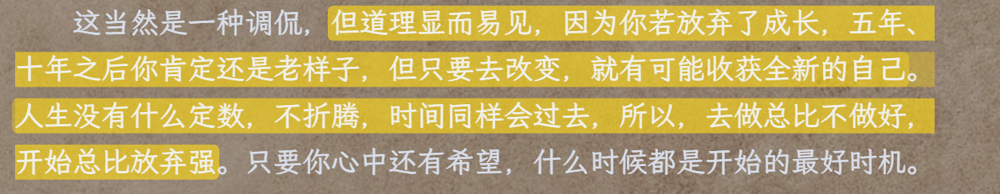

大脑的三个组成部分:理智脑,本能脑,情绪脑.在这其中理智脑是在耗能和发育最晚的,对大闹的控制也是最弱的,同时也是最新的,
本能是是为了给保护自己.情绪成为了人的天性.
人类有大脑的三个组成部分不是为了互相牵制,用意志去抵抗自己的本能反应,进步的最终目的是为了让三个部分互相配合,利用理智脑驱动本能和情绪,将焦虑的事情化作为紧迫的事情,将一不可能完成的任务拆分成为一个个可能的捷径.
变向思维,将一个不好的方向转变为一个可能的好的方向.

## 焦虑赖思羽没有足够的安全感
始终相信自己做总比不做强,胜利仅仅需要一次但是可以允许自己失败无数次.
选择焦虑来源于信息不足,毛主席说没有调研就没有发言权,下次遇到这样的事情问自己,了解事情的真相么,这个对自己的影响真的非常的大么.如果是的话能不能解决呢,从什么地方解决,或者说这个焦虑是基于哪些维度产生的,通过这些方式去解决,等待或许没有错,但是想要找到正确就需要走下去,即便会产生一定的错误,但是没有影响,总比没有做好.

原谅自己有些事情是做不到的,虽然说做总比不做好但是同样的不要违反自己的本能,有点矛盾但是也有道理不是么.

书中说焦虑的产生在于一次性想要做很多的事情但是又想要立马见到效果但是这样显然是既要又要的,我们既然原谅自己有些事情做不到的为什么不能发觉身边的事情为什么是一定可以做到的呢,从另外的一个角度说即便做一件困难的事情也不会是一蹴而就的,它会被分为无数个小段落,我们只需要记住一切速胜派都是投降派,放到我们的生活中来说想要瞬间做到对自己来说困难的事情,本身就是在放弃做这件事情.

坚持不是一种克制而是一种享受,这是一种相对的说法,苦中作乐的意思是即便身处在不好的环境中我依然可以找到快乐,而不是把苦和快乐交换,如果理解了这个看法那么将话题返回就可以理解思考的本质是为了合理的顺应自己的本能利用自己的本能,是一种寻找出路,焦虑就是困在原地陷入原地.说到克制我想到克制的含义有双重理解第一个理解是克制坏的事情,还有一个就是克制自己不要让自己太累,这才是有效的克制.

写着写着我不免想起到我之前学过的英语单词insist,resist,即坚持和克制,我有一个更加具有哲学意义的想法克制就是平衡.

## 耐心是坚持的燃料
缺乏耐心是人类的天性,这是因为本能脑需要让人去做简单的事情,缺乏耐心本来就不是什么可耻的事情和自己的道德品质也没有任何的关系.那么有没有什么办法去解决或者说变相的将缺乏耐心变为坚持呢(在这里貌似和大任务分割很像说到这里我突然想到了tcp/ip中的一个知识点,TCP作为一个通信传递道路的构建,ip协议是将通信数据分成一个个小的数据,从各个地方去寻找目标地点,貌似逻辑的终点是这些,哲学的本质在于认识自己).
从社会学的角度看社会精英通常是更加具有耐心的人,但是为什么.是因为他们废了很大力气去克制天性么,那么花费了这么多时间还有能力去提升自身地位的时间或者精力么显然不是,那么就进是什么.我的理解是不断的增大自己的舒适圈,在不会走路的时候我会觉得学走路很困难,但是后面跑步觉得走路是一件在正常不过哦的事情了,这算不算是一种打磨舒适圈呢,当然算.所以解决事情不是靠某一种思想就可以的尽管有的时候觉得它很有道理,但是问题的解决有属于它的工具,道理也是一样,克制,耐心,坚持,所以在你因为事情做不好从而焦虑的时候有么有想过是做事情的方式错了,跳出舒适圈,是让自己处于"有点难度的范围",提升自己不是累死自己,挫折不是结果是为了提升自己,这里涉及到长期的眼光和短期的想法.

所以耐心是什么我觉的是上述两个观点的产物,自然而然的具有的性质.
人生在于平衡有的时候要求自己可以做到某件事情,但是为什么不想想给自己失败的可能.

做事成功的秘诀是上瘾,或者是满足自己的成就感,最具备当前性质的无非就是表现自己在某个平台上

## 潜意识
·《超越感觉》一书告诉我们，想拥有清晰的逻辑，就坚持一点：凡事不要凭模糊的感觉判断，要寻找清晰的证据。

要想不受其困扰，唯一的办法就是正视它、看清它、拆解它、化解它，不给它进入潜意识的机会(恐惧来源于未知)，不给它变模糊的机会；即使已经进入潜意识，也要想办法将它挖出来。所以，当你感到心里有说不清、道不明的难受的感觉时，赶紧坐下来，向自己提问。-- 这里和我说的平衡想法是类似的任何事物思考好的方面的同时也要参照不好的方面的.好的方面利用以大化小用自身的本能去做,坏的方面同时也是依靠自身的本能去做,依靠懒惰起逃避坏的方面,这对自己没有任何的影响

恐惧就是一个欺软怕硬的货色，你躲避它，它就张牙舞爪，你正视它，它就原形毕露.

人生就是一场消除模糊的比赛.

人类依靠本能去生活,本能实际上是能力的积累,当真正的掌握了以后,天性就是依靠所掌握的观点去解决实际问题,因为本能反应效率远远高于理智的决策,这两者相辅相成

先用感性能力帮助自己选择，再用理性能力帮助自己思考
# 读书的观点
* 为什么刚才这个点让我有启发？
* 我能够把这个启发点用在3个不同的事情上吗？
* 这个启发点有没有其他类似的知识？

