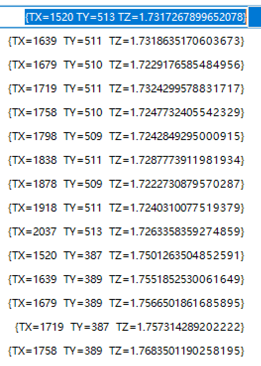

~~为什么检测平面pin点仅仅出现了一个~~ 
**答案检测数量没有改变**

~~如果出现目标点位死活找不到是否可以在之前设定一检测程序,并且对当前的检测疯狂的加屏蔽框再次检测斑点,从而计算位置.~~
**如果快速的情况那么就需要联系销售,或者是其他的问题**

~~现在需要做的就是将每个点位记住.~~
**基本记住**

~~现在这里有一个问题，目标物体的基准面是通过各个针脚之间的高度组合凑成的一个（平均基准面或者是最大基准面，那么如果这个时候去修改其中的一个目标位置是否会出现基准面移位的情况）。~~
**确实会出现这样的情况,所以每一次的修改都需要使用历史里路的保存使得改错程序还可以修改回来的程度**

*今天发生的问题,在程序中调增了相机设定为4倍数的宽高比但是我的注册图片是原始的图片,所以在扫描的过程中可能会出现扫描的点不稳定*

设定0013 X5658_非满PIN黑色c d　：　待优化

~~设定0017 X5658_非满PIN黑色 : 3000速度~~

设定0018 X5658_满PIN黑色 : CD提速程序待优化
* ~~框选目标位置~~
* S5点位提速检测
* bR,bL 提速检测

设定0019 X5658_满PIN_BY : *CD提速程序*待优化

设定0020 X5658_非满PIN_BY : CD提速程序待优化

设定0099 X5658_满PIN黑色 :  备份黑色满pin

~~设定0100 X5658_满PIN_BY : 表演未提速~~

~~设定0200 X5658_非满PIN_BY : 表演 未提速~~

试试浓淡处理 - 平面

快速程序位置检测使用,斑点工具做位置补正使用连续轮廓工具获取位置

## 思路
**数据提取**
* 通过斑点工具结合高度抽取得到目标点的位置
* 并且通过位置阵列高度等去保存提取到的数据,
* 其次通过虚拟平面去计算平面度(逻辑最复杂的地方),
	* 利用28PIN点拟合平面去计算当前的点是否满足在范围区间内
	* 利用铁壳面作为基准面去检测28个pin满足在某个区间内
	* 利用拟合28PIN去检测E1 - E6 
	* ......
* 上面操作完成后同样保存平面度
模型检测
* 使用当前完整程序流程测试生产产品,

数据输出
判断NG与OK

## 设定变量

| 程序名称             | 状态  |     |
| ---------------- | --- | --- |
| ALL_PIN_BLACK_CD | 修改中 |     |
## 不懂

| 函数         | 功能       |
| ---------- | -------- |
| RSLT.AVXYZ | 平均高度绝对检测 |
